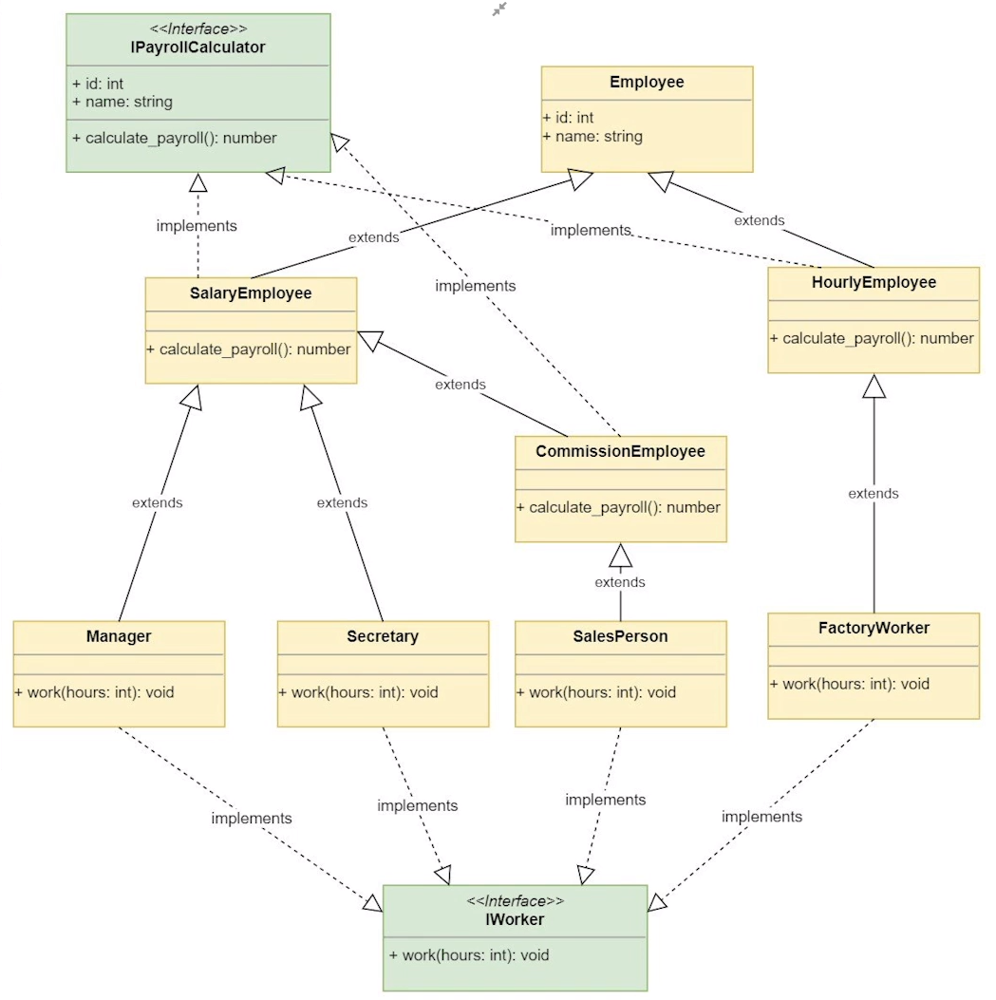

# REAL PYTHON OOP PROJECT PATH

First: Basic UML:
Video: Implementing a Class Hierarchy
url: https://realpython.com/lessons/implementing-class-hierarchy/

Second: OOP Explotion Problem ( classes declarations growing on exponential way )
Video: Implementing the Productivity System
url: https://realpython.com/lessons/implementing-productivity-system/

**Notes:**  
Employee is an Abstract Class, so **we do not intanciate it**
For a better approach we import from basic python libraries
to indicated to other developers that is an **abstrated class**

´´´python
from abc import ABC, abstractmethod

class Employee(ABC):
    def __init__(self, id, name):
        self.id = id
        self.name = name

    @abstractmethod
    def calculate_payroll(self):
        pass

´´´