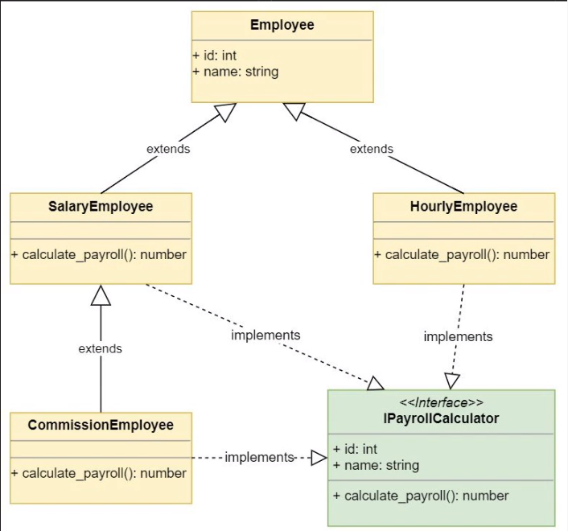
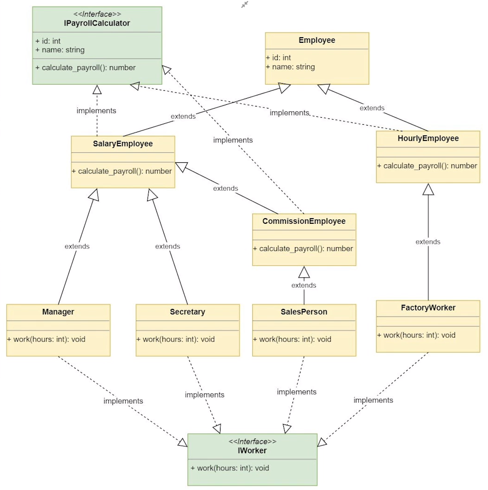
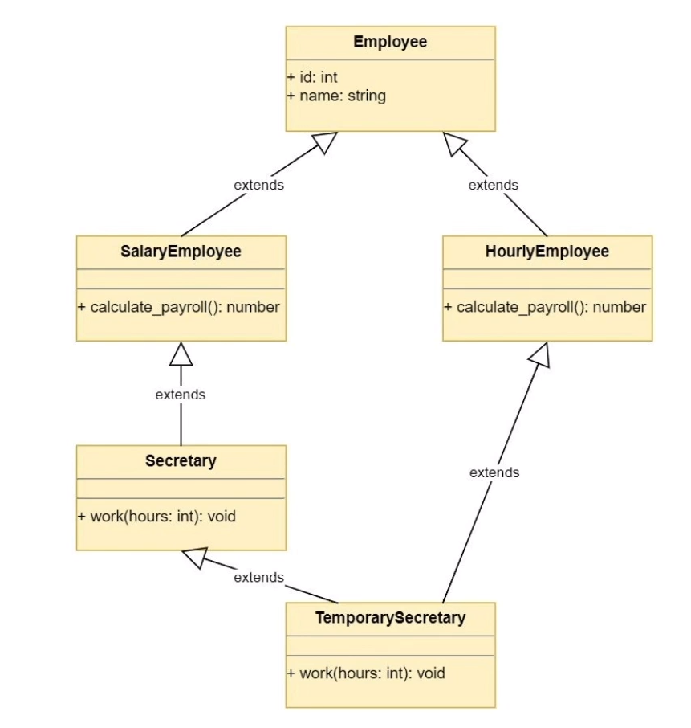

# REAL PYTHON OOP PROJECT PATH
  
  
**First: Basic UML:**
Video: Implementing a Class Hierarchy  
url: https://realpython.com/lessons/implementing-class-hierarchy/  


<br>
<br>

**Second: OOP Explotion Problem ( classes declarations growing on exponential way )**  
Video: Implementing the Productivity System  
url: https://realpython.com/lessons/implementing-productivity-system/  


<br>

**Third: Multiple Inheritance**
Video: https://realpython.com/lessons/multiple-inheritance/

If our UML diagram forms a **Diamond**, Python will use MRO to find the desired method.  
We can patch our MultiInteritance Class and we must to be very carefully how to patch  
If you have a **Diamond** on UML, Best practice y reformulate OOP

<br>

**Notes:**  
Employee is an Abstract Class, so **we do not intanciate it**
For a better approach we import from basic python libraries
to indicated to other developers that is an **abstrated class**

<br>

```python
from abc import ABC, abstractmethod

class Employee(ABC):
    def __init__(self, id, name):
        self.id = id
        self.name = name

    @abstractmethod
    def calculate_payroll(self):
        pass

```
<br>
<br>

Using **Method Resolution Order** is very important know atributtes and definitions on any class  

<br>

Example:
```console
foo@bar:~$ python
>>> from employees import TemporarySecreatry
>>> TemporarySecreatry.__mro__
```
  
Output:
```console
(<class 'employees.TemporarySecretary'>, <class 'employees.HourlyEmployee'>, <class 'employees.Secretary'>, <class 'employees.SalaryEmployee'>, <class 'employees.Employee'>, <class 'abc.ABC'>, <class 'object'>)
```
